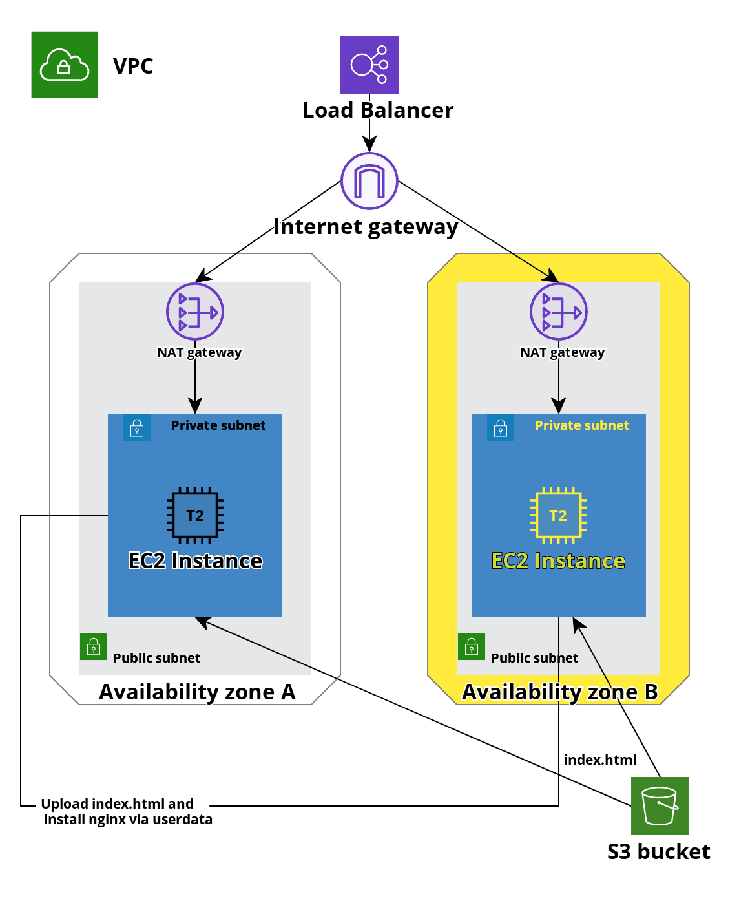

<h1>Terraform task</h1>
This code allows U to deploy the infrastructure, which includes:
<ul>
<li>1 VPC</li>
<li>2 Public subnets</li>
<li>2 Private subnets</li>
<li>2 Instances with latest version of Ubuntu at private subnets</li>
<li>1 Internet gateway</li>
<li>2 NATs at different AZ</li>
<li>1 Loadbalancer</li>
<li>The script with is installing nginx and copy index.html from S3</li>
</ul>

The diagram of this is provided below:

P.S. Please make sure that U have the necessary permissions before deploying.